# Online Retail Analysis & Revenue Forecasting

A data science project using the **Online Retail dataset from the UCI Machine Learning Repository**.

The project explores retail transactions through **EDA and RFM analysis**, then builds a daily revenue forecasting pipeline using several machine learning approaches. A small **Streamlit app** is also included to make the analysis easier to explore with the original dataset or a user-uploaded file.

## Dataset

The project uses the [Online Retail dataset](https://archive.ics.uci.edu/dataset/352/online+retail) from the UCI Machine Learning Repository.

The dataset contains transactions from a UK-based online retailer between **December 2010 and December 2011**.

The main columns are:

- `InvoiceNo` - Invoice/transaction number
- `StockCode` - Product code
- `Description` - Product description
- `Quantity` - Number of items purchased
- `InvoiceDate` - Date and time of the transaction
- `UnitPrice` - Price per item
- `CustomerID` - Customer identifier
- `Country` - Customer's country

The dataset itself is not included in this repository.

## What is included?

### Exploratory Data Analysis

The EDA module contains functions for exploring several aspects of the retail data, including:

- Data cleaning and preprocessing
- Product and price analysis
- Country-level revenue and quantity analysis
- Customer-level analysis
- Daily, weekly, monthly, quarterly and yearly sales trends
- Revenue and quantity distributions
- Time-based heatmaps
- Product sales and product volatility
- Order/product diversity
- Basket size analysis
- RFM analysis and customer segmentation

Most of the visualizations are interactive **Plotly** charts.

### RFM Analysis

Customers are analyzed using the three standard RFM measures:

- **Recency** - how recently a customer purchased
- **Frequency** - how often a customer purchased
- **Monetary** - how much a customer spent

Customers are assigned segments based on their RFM scores, and the project also provides summaries and visualizations of the resulting segments.

## Revenue Forecasting

The forecasting pipeline predicts **daily revenue** from the transaction data.

The preprocessing step:

1. Removes duplicate and invalid transactions.
2. Removes cancelled and non-product transactions.
3. Calculates transaction revenue as `Quantity × UnitPrice`.
4. Aggregates revenue by day.
5. Creates lag and rolling features.
6. Creates temporal features.
7. Applies cyclic encoding to date-related features.

The forecasting features include revenue lags such as **1, 3, 7 and 14 days**, along with **7-day and 30-day rolling statistics**.

### Models

The project was initially explored using multiple forecasting approaches, including:

- Linear Regression
- XGBoost
- Lasso
- Ridge Regression
- Random Forest
- ARIMA
- Prophet

The final implementation uses **Ridge Regression and Random Forest** as an ensemble.

The predictions are blended using:

```text
Final Prediction = 0.55 × Ridge + 0.45 × Random Forest
```

The models are trained using **TimeSeriesSplit with 5 splits** to preserve the chronological nature of the data.

### Model Evaluation

The forecasting pipeline calculates:

- MAPE
- MSE
- R²

The best recorded blended result achieved a **MAPE of 20.79%**.

> **Note:** The exact result can depend on the preprocessing and data used when running the project.

## Forecasting Future Revenue

The pipeline can forecast the next day as well as multiple future days.

For multi-day forecasting, the pipeline iteratively adds a future date, creates the required features, predicts revenue, and then uses that prediction when generating features for the following day.

The default forecast horizon is **7 days**.

## Streamlit App

A Streamlit application is included in:

```text
streamlit_app/app.py
```

The application is called **Retail Forecasting Dashboard**.

It allows the user to:

- Load the default dataset
- Upload a CSV, Excel, Parquet or JSON dataset
- Preview the data
- Explore product and price information
- Explore country-level metrics
- Explore customer-level metrics
- View sales and quantity visualizations
- Explore RFM-related analysis

#### Sample Images
1. Upload Widget, Raw Data Preview and Cleaned Data Preview
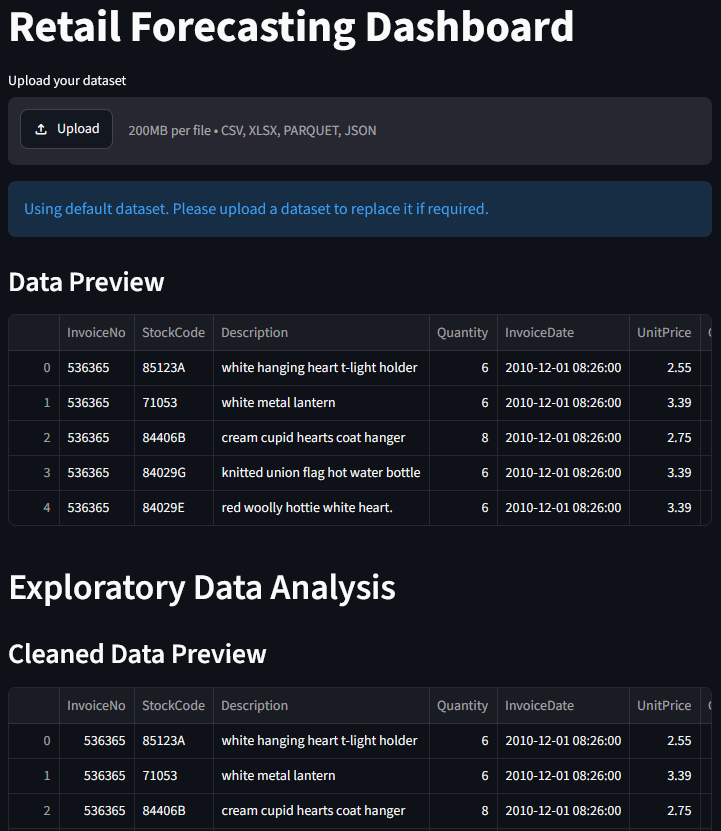
---
2. Plot top countries according to metric
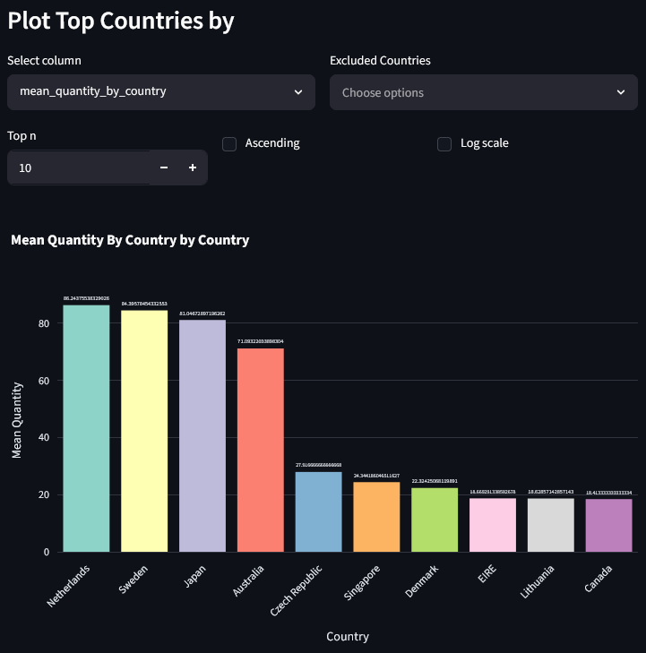
---
3. Treemap of countries according to a selected metric with option to exclude countries
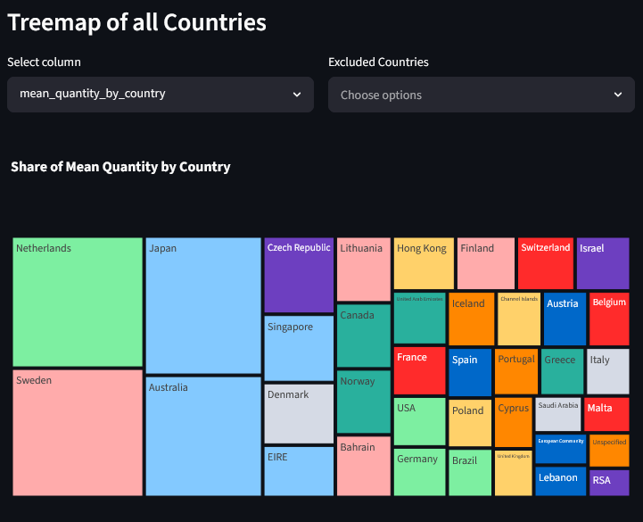
---
4. Plot of daily revenue or quantity with option to highlight missing data
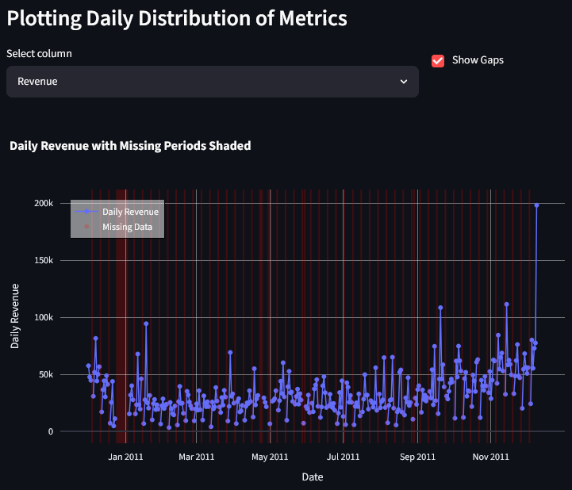
---
5. Plot of histogram of daily revenue with option to change bin size
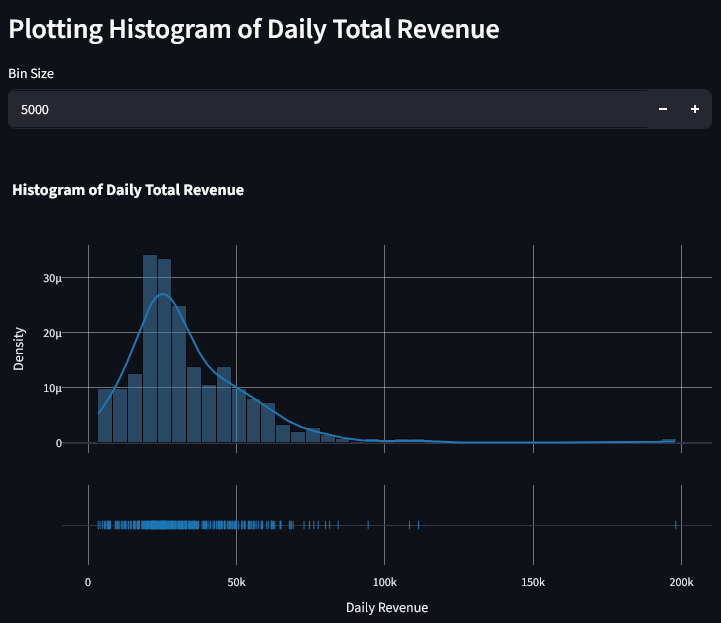
---
6. Heatmap of revenue distribution
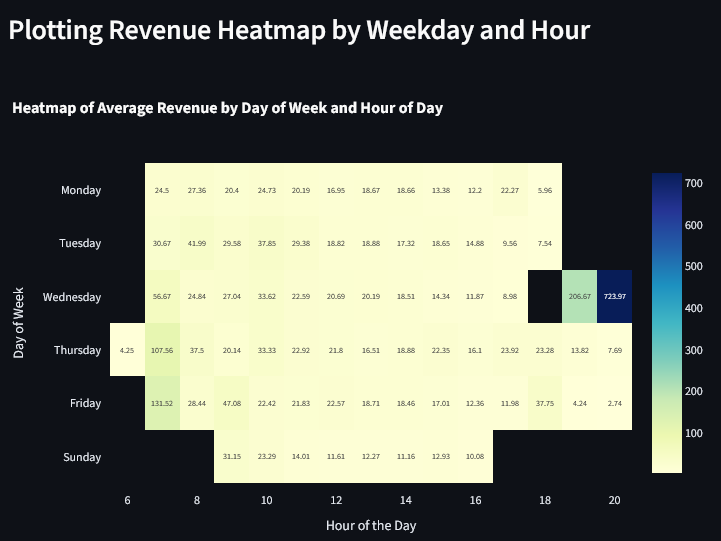
---
7. Scatterplot of Daily Revenue vs Daily Units Sold
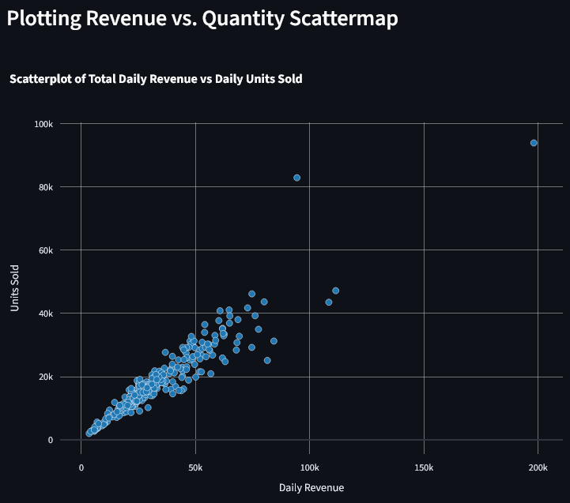
---
8. Boxplot of revenue with option for plot orientation
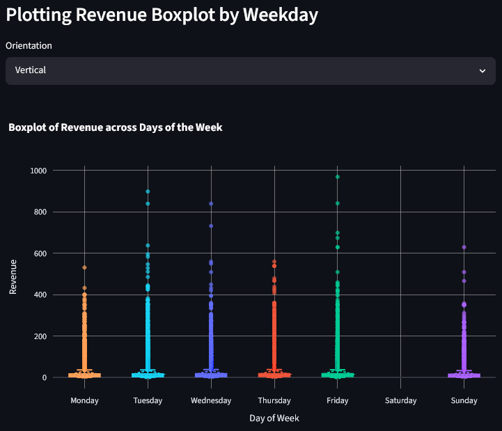
---
9. Overlapping bar graphs comparing mean revenue and quantity
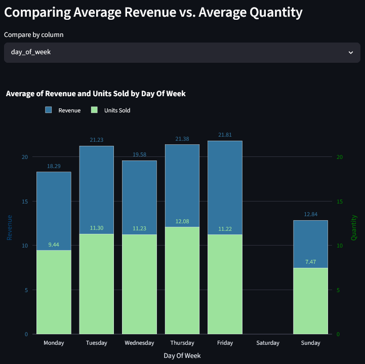
---
10. Table of top n products according to a selected metric with option for how many products to show and whether to show top or bottom products
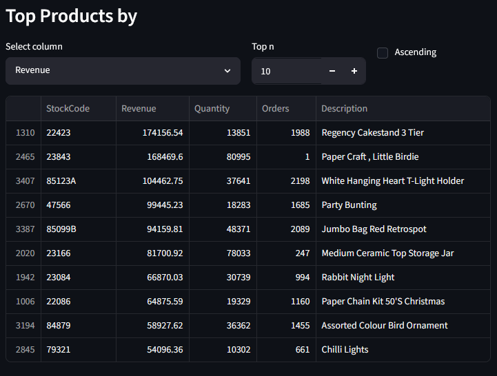
---
11. Plotting monthly revenue with trend line
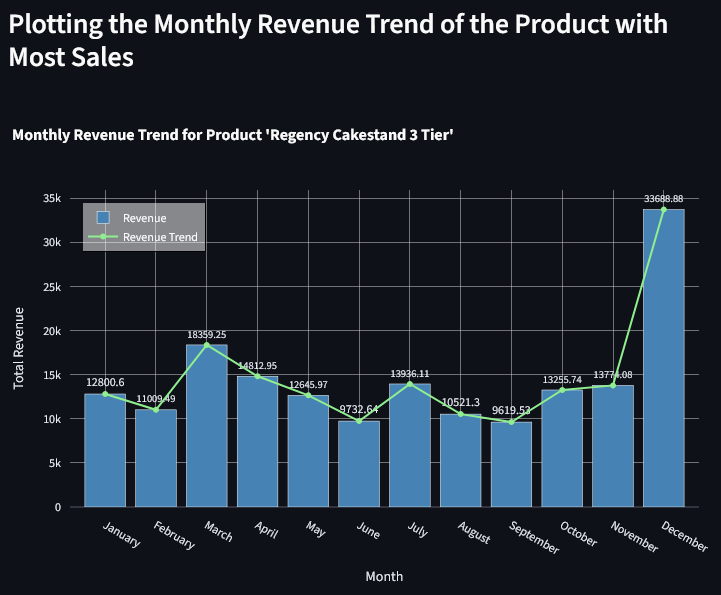
---
12. RFM Analysis
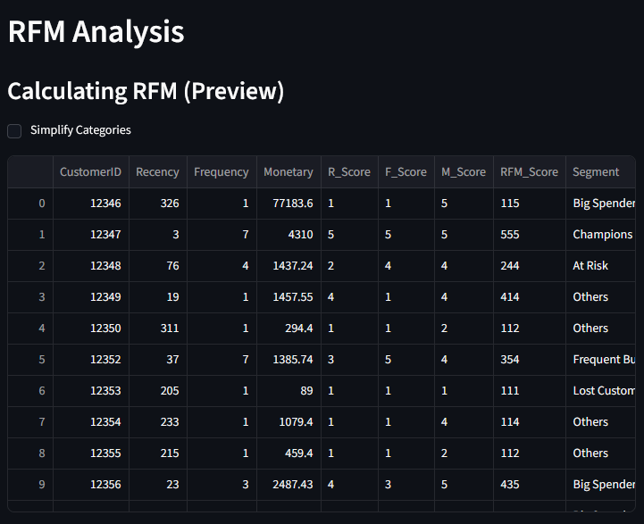
---
13. Forecasting section
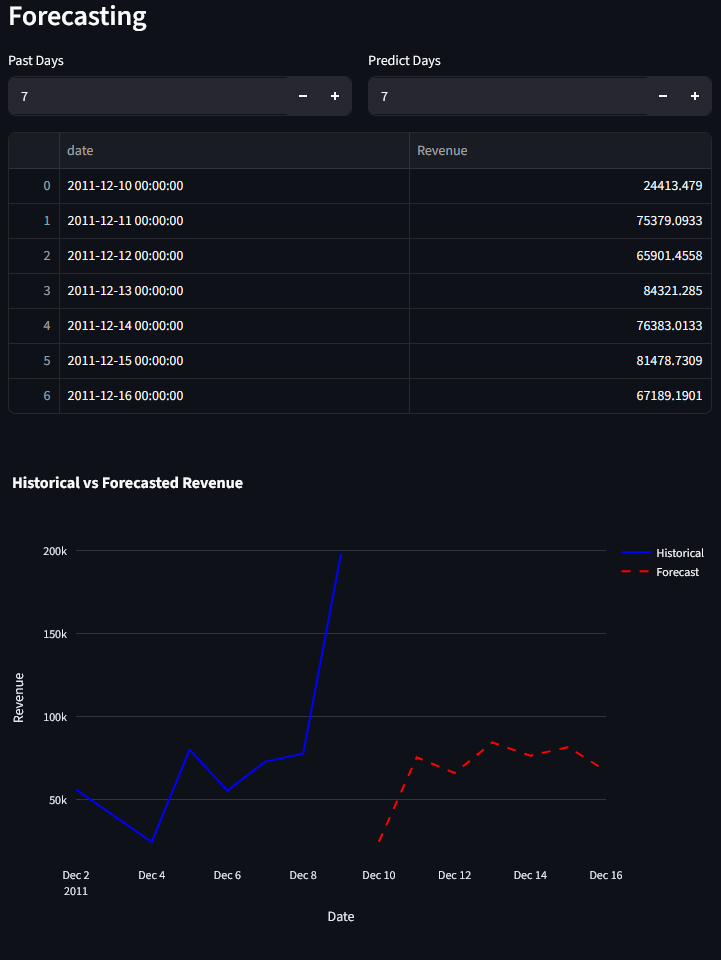
---

## Project Structure

```text
Project/
│
├── src/
│   ├── __init__.py
│   ├── utils.py                   # Data loading and common preprocessing
│   ├── eda.py                     # EDA, visualizations and RFM analysis
│   └── forecasting.py             # Revenue forecasting pipeline
│
├── streamlit_app/
│   └── app.py                     # Streamlit application
│
├── main.py
├── requirements.txt
├── LICENSE
└── README.md
```


## Installation

Clone the repository:

```bash
git clone https://github.com/mishrasumitranjan/UCI-Online-Retail.git
cd UCI-Online-Retail
```

Create a virtual environment if desired:

```bash
python -m venv .venv
```

Activate it on Windows:

```bash
.venv\Scripts\activate
```

Install the required packages:

```bash
pip install -r requirements.txt
```

## Running the Streamlit App

From the project root:

```bash
streamlit run streamlit_app/app.py
```

The application will open in your browser.

Place the Online Retail dataset in:

```text
data/Online Retail.csv
```

Alternatively, the application provides an option to upload a dataset.

## Technologies Used

- Python
- Pandas
- NumPy
- Scikit-learn
- Matplotlib
- Seaborn
- Plotly
- Streamlit
- Joblib

## Key Results

| Area | Result |
|---|---|
| Dataset | UCI Online Retail |
| Transactions | 541,909 |
| Analysis | EDA + RFM |
| Forecast Target | Daily Revenue |
| Time Series CV | 5 splits |
| Final Models | Ridge + Random Forest |
| Blend | 55% Ridge + 45% Random Forest |
| Best Recorded MAPE | **20.79%** |
| Forecast Horizon | 1 day / multiple days |

## Possible Future Improvements

Some possible improvements for the project are:

- FastAPI Integration
- Improve the Streamlit interface and navigation.
- Add more detailed forecast evaluation and model comparison.


## Dataset Reference

Chen, D. (2015). **Online Retail [Dataset]. UCI Machine Learning Repository.**

https://archive.ics.uci.edu/dataset/352/online+retail

## Author

**Sumit Ranjan Mishra**

- GitHub: https://github.com/mishrasumitranjan
- LinkedIn: https://www.linkedin.com/in/sumit-ranjan-mishra/
